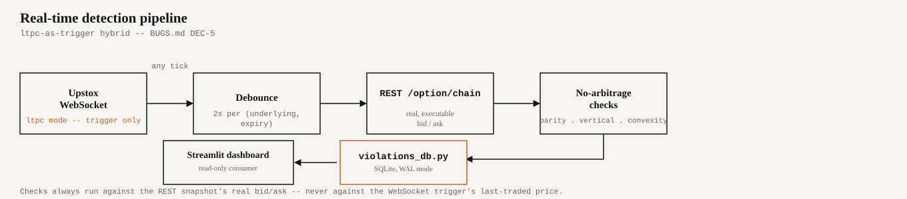
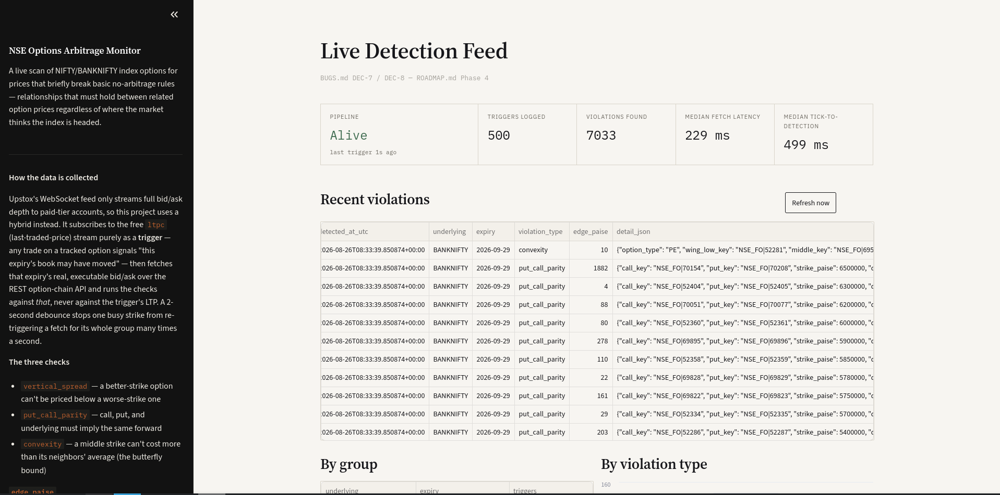
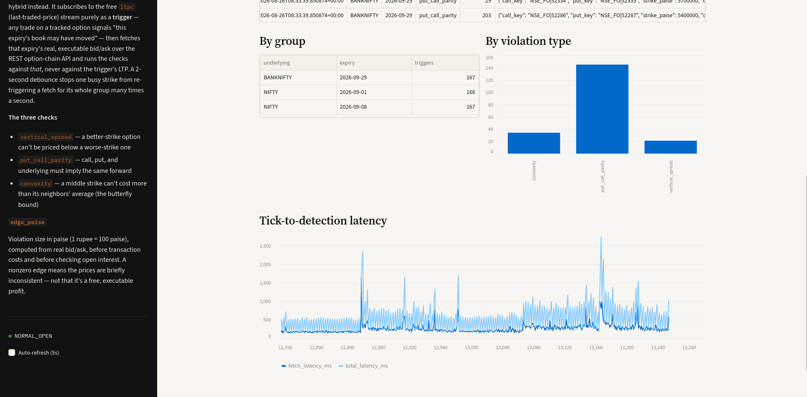
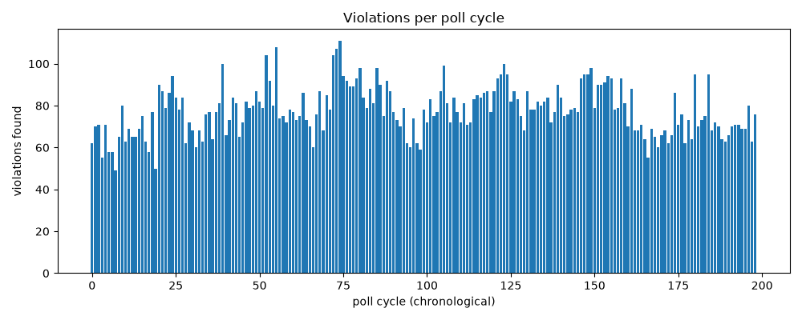
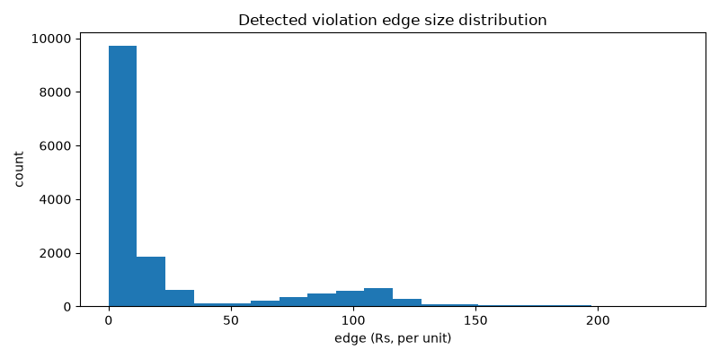
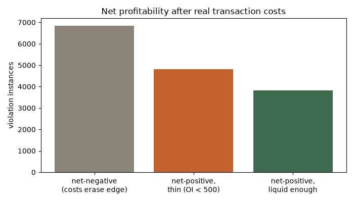
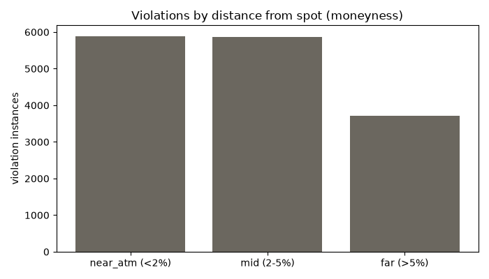

# NSE Options Arbitrage Detection Engine

**Status:** 🟢 Core system built, tested, and running live against real NSE market data.

A system that detects no-arbitrage bound violations in NSE index options (NIFTY/BANKNIFTY): cases where related contracts (a vertical spread across strikes, a call/put pair via put-call parity, or a butterfly across three strikes) are priced in a way that violates model-independent replication arguments, creating a risk-free or statistically favorable position. Rather than trusting quoted prices as ground truth, this project builds an independent consistency layer, backtests how often and how fast mispricings correct net of real transaction costs, and layers in real-time detection via WebSocket.

> **60-second version:** "I built a system that detects no-arbitrage bound violations in NSE index options: cases where related contracts (a vertical spread across strikes, a call/put pair via put-call parity, or a butterfly across three strikes) are priced in a way that violates model-independent replication arguments. I built my own consistency layer rather than trusting quoted prices as ground truth, backtested how often and how fast these mispricings correct net of real transaction costs, and layered in a real-time detection pipeline via WebSocket. Along the way I hit a real infrastructure constraint (the WebSocket feed only streams full order-book depth to a paid account tier), and rather than quietly fall back to a weaker signal, I designed around it with a trigger-plus-REST hybrid that keeps every check honest."

## Method

- **Structural no-arbitrage checks** ([src/models/consistency.py](src/models/consistency.py)): put-call parity (against a market-implied forward, not an assumed dividend yield; see Bug Log), vertical spread monotonicity, butterfly convexity, and calendar (cross-expiry) monotonicity. Each is a *replication* argument, not a statistical model: a violation means two positions with the same payoff in every future state are priced differently today.
- **Real transaction costs** ([src/models/transaction_costs.py](src/models/transaction_costs.py)): brokerage, STT, exchange charges, stamp duty, SEBI charges, IPFT, and GST, not a flat approximation. A violation that's profitable gross and unprofitable net is the normal case, not an edge case, especially for multi-leg checks like the butterfly.
- **Backtest & persistence** ([src/backtest/analyze_violations.py](src/backtest/analyze_violations.py)): reconstructs every historical poll cycle from `data/snapshots.db` and re-runs every check against it, tracking how long each specific violation persists and whether it stays net-positive after real costs, segmented by moneyness and open interest.
- **Real-time detection** (see Architecture below): a live WebSocket-triggered pipeline running the same checks against production data, not just historical replay.
- **Implied volatility curve** (stretch goal, [src/models/fair_value.py](src/models/fair_value.py)): a two-pass outlier-robust spline fit flags strikes whose IV deviates from their neighbors, plus a realized-vs-implied volatility comparison. This is a *statistical* view, not a structural guarantee, kept explicitly separate from the structural checks rather than conflated with them.

## Architecture: the real-time detection pipeline

Upstox's WebSocket feed only streams full order-book depth (bid/ask) to paid-tier accounts. This project's Analytics token (and, confirmed by testing, a freshly-issued full OAuth2 App token too) gets no response at all from that mode (see [BUGS.md](BUGS.md) DEC-5). Rather than treat that as a blocker, or quietly fall back to using last-traded-price in the checks (which would reintroduce the exact mid-price-leakage failure mode this project is built to avoid), the free `ltpc` (last-traded-price) stream is used purely as a **trigger**: any tick tells the pipeline "this expiry's book may have moved," which fires a debounced REST call for that expiry's real, executable bid/ask, and every check runs against *that*, never against the trigger itself.



Live-tested against the open market: sub-second tick-to-detection latency throughout, zero dropped connections. Full writeup, including the systematic testing that ruled out "wrong credential type" as the explanation before settling on this design: [BUGS.md](BUGS.md) DEC-5 / DEC-6.

## Live dashboard

A decoupled, read-only Streamlit dashboard (`src/dashboard/streamlit_app.py`) reads the same SQLite log the detection pipeline writes to. It can be started, stopped, or crash without ever affecting data collection, since neither process depends on the other being alive.





## Results

Numbers below are from a real backtest run against accumulated live data (`python src/backtest/analyze_violations.py`), **199 poll cycles spanning ~4h55m on 2026-08-26**, a short accumulation window, stated as such rather than dressed up. Re-run the script for current numbers as the poller accumulates more history.

- **15,459 violation instances** detected across 318 distinct violation identities (put-call parity: 8,572 · calendar: 4,839 · convexity: 1,054 · vertical spread: 994).
- **8,613 of those stayed net-positive per lot after every real transaction cost.** But **4,802 of those 8,613** sit on legs with open interest under 500, likely unexecutable at the quoted size, not a real edge. That leaves **~3,811 instances both net-positive and liquid enough to take seriously**; see [BUGS.md](BUGS.md) DEC-3 for why "net of costs" and "actually tradeable" are different claims, and the chart below for the breakdown.
- The single largest net-positive instance found this run (a BANKNIFTY calendar violation, ≈₹6,661/lot) has **zero open interest**, explicitly the kind of number that looks impressive and isn't, flagged automatically by the script rather than presented as a headline result.
- Violations are somewhat more common near the money than far from it (5,889 near-ATM vs. 3,706 far-OTM/ITM), consistent with near-the-money strikes being where most quoting and trading activity actually happens.
- Violations seen in ≥2 cycles persisted a median of ~4.2 hours (n=275), but treat this specific number skeptically: the max observed persistence (~4.9 hours) is nearly the entire observation window, which is the signature of **right-censoring** (a violation identity present since before data collection started, or still ongoing when it ended), not necessarily genuine multi-hour persistence. A longer accumulation window is needed before this number means what it looks like it means.

| Violations per poll cycle | Edge size distribution |
|---|---|
|  |  |

| Net profitability after real costs | Violations by moneyness |
|---|---|
|  |  |

## Known limitations

Stated up front rather than left for someone else to find:

- **Single broker, single exchange.** All data comes from Upstox against NSE; no cross-venue comparison (e.g. NSE vs BSE) and no consolidated-tape view.
- **Native order-book depth is unavailable at this account tier** (BUGS.md DEC-5). The real-time layer works around this with a trigger+REST hybrid rather than a true streaming depth feed, at the cost of REST round-trip latency (measured: sub-second, but not zero).
- **Small sample size, still accumulating.** Both the persistence statistics and the IV-curve forward-evaluation (RMSE/MAE against a naive baseline) need more elapsed time before their numbers are statistically meaningful, not just pipeline-correctness checks.
- **No execution or slippage modeling.** "Net of transaction costs" assumes a fill at the quoted bid/ask; real execution against a thin book would move the price against you, which this project doesn't simulate.
- **A risk-free rate assumption feeds the parity check.** A small calibration error there could register as a marginal "violation" that's actually rate-assumption noise rather than real mispricing.
- **Persistence numbers are subject to right-censoring** in a short observation window (see Results above), a real statistical bias, not just a caveat for its own sake.

The fuller bug/decision trail, including a systematic false-positive investigation that went from 44 flagged violations down to 3 real ones, is in [BUGS.md](BUGS.md).

## Project docs

- [BUGS.md](BUGS.md): bug report log and decision log, what broke, how it was found, what changed, and why
- [LAUNCH_STEPS.md](LAUNCH_STEPS.md): exact commands to start/stop/check on the poller, including what to do after a reboot

## Setup

```bash
python -m venv venv
source venv/bin/activate
pip install -r requirements.txt
cp .env.example .env  # fill in UPSTOX_ACCESS_TOKEN -- see LAUNCH_STEPS.md S6/S8
```

See [LAUNCH_STEPS.md](LAUNCH_STEPS.md) for how to actually run things day-to-day, including the live detection pipeline (`src/data/realtime_hybrid.py`) and its dashboard (`streamlit run src/dashboard/streamlit_app.py`).

## License

TBD.
