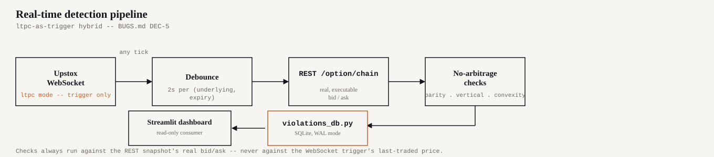
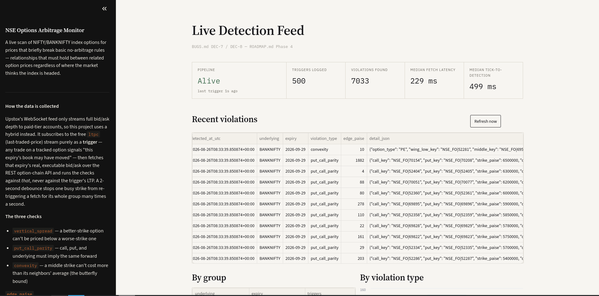
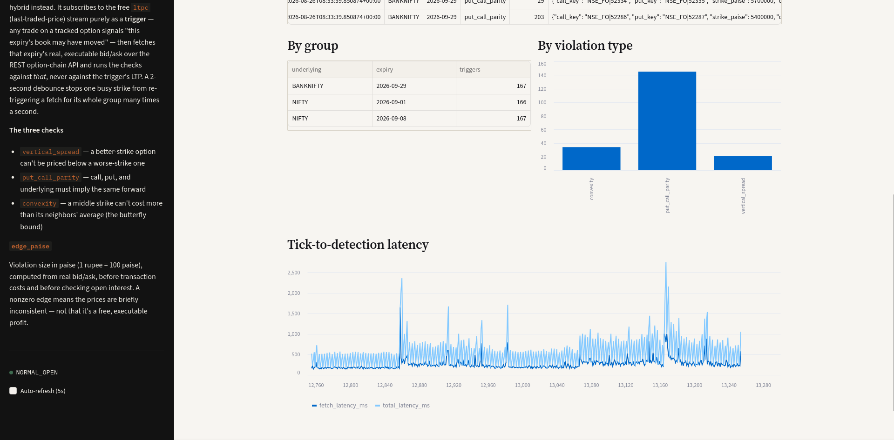
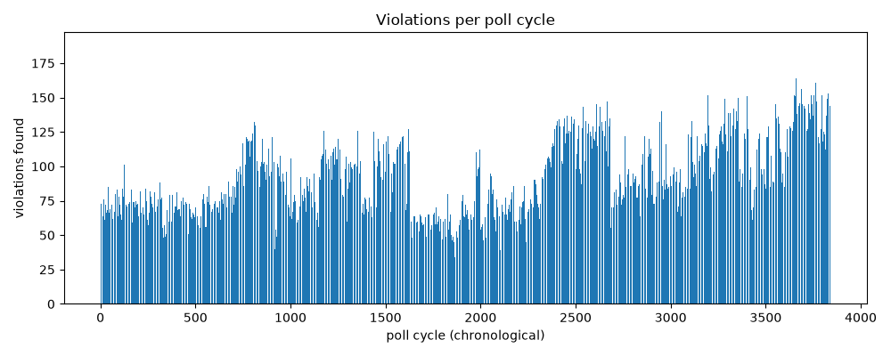
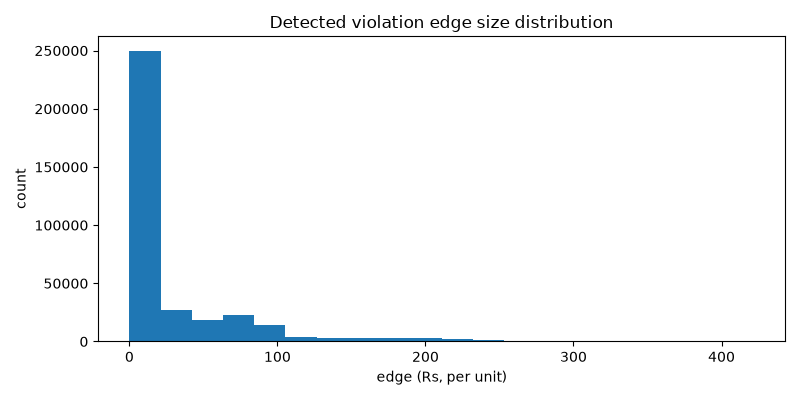
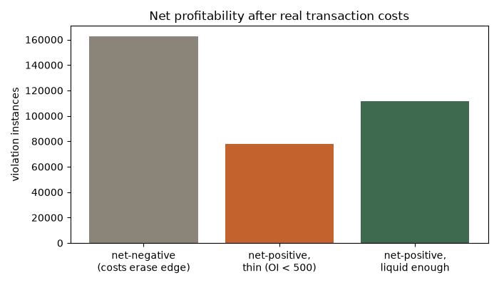
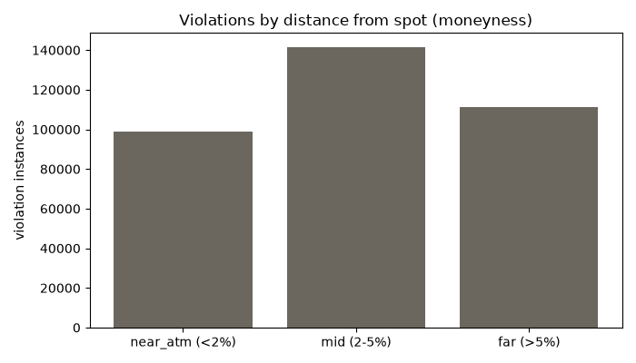

# NSE Options Arbitrage Detection Engine

**Status:** core detection and backtest pipeline complete, validated against 3,841 live poll cycles of NSE options data (2026-08-27 to 2026-09-12).

A system that detects no-arbitrage bound violations in NSE index options (NIFTY/BANKNIFTY): cases where related contracts (a vertical spread across strikes, a call/put pair via put-call parity, or a butterfly across three strikes) are priced in a way that violates model-independent replication arguments, creating a risk-free or statistically favorable position. Rather than trusting quoted prices as ground truth, this project builds an independent consistency layer, backtests how often and how fast mispricings correct net of real transaction costs, and layers in real-time detection via WebSocket.

## Method

- **Structural no-arbitrage checks** ([src/models/consistency.py](src/models/consistency.py)): put-call parity (against a market-implied forward, not an assumed dividend yield; see [BUGS.md](BUGS.md)), vertical spread monotonicity, butterfly convexity, and calendar (cross-expiry) monotonicity. Each is a *replication* argument, not a statistical model: a violation means two positions with the same payoff in every future state are priced differently today.
- **Real transaction costs** ([src/models/transaction_costs.py](src/models/transaction_costs.py)): brokerage, STT, exchange charges, stamp duty, SEBI charges, IPFT, and GST, not a flat approximation. A violation that's profitable gross and unprofitable net is common, especially for multi-leg checks like the butterfly.
- **Backtest & persistence** ([src/backtest/analyze_violations.py](src/backtest/analyze_violations.py)): reconstructs every historical poll cycle from `data/snapshots.db` and re-runs every check against it, tracking how long each specific violation persists and whether it stays net-positive after real costs, segmented by moneyness and open interest.
- **Real-time detection** (see Architecture below): a live WebSocket-triggered pipeline running the same checks against production data, not just historical replay.
- **Implied volatility curve** ([src/models/fair_value.py](src/models/fair_value.py)): a two-pass outlier-robust spline fit flags strikes whose IV deviates from their neighbors, plus a realized-vs-implied volatility comparison. A statistical view, kept separate from the structural checks above rather than conflated with them.

## Architecture: the real-time detection pipeline

Upstox's WebSocket feed only streams full order-book depth (bid/ask) to paid-tier accounts; this project's Analytics token, and a freshly-issued full OAuth2 App token, both get no response from that mode (see [BUGS.md](BUGS.md) DEC-5). The free `ltpc` (last-traded-price) stream is used purely as a trigger instead: any tick signals that an expiry's book may have moved, which fires a debounced REST call for that expiry's real, executable bid/ask, and every check runs against that REST snapshot, never against the trigger tick itself.



Live-tested against the open market: sub-second tick-to-detection latency, zero dropped connections. See [BUGS.md](BUGS.md) DEC-5/DEC-6 for the testing that ruled out a credential-type issue before settling on this design.

## Live dashboard

A decoupled, read-only Streamlit dashboard (`src/dashboard/streamlit_app.py`) reads the same SQLite log the detection pipeline writes to. It can be started, stopped, or crash without affecting data collection, since neither process depends on the other being alive.





## Results

Numbers below are from a full backtest run (`python src/backtest/analyze_violations.py`) against **3,841 poll cycles collected 2026-08-27 to 2026-09-12** (gaps correspond to market close and weekends). Re-run the script for current numbers as the poller accumulates more history.

- **351,781 violation instances** detected across 1,597 distinct violation identities (put-call parity: 175,711 · calendar: 131,534 · convexity: 34,311 · vertical spread: 10,225).
- **189,132 of those stayed net-positive per lot after every real transaction cost.** Of those, 77,794 sit on legs with open interest under 500, likely unexecutable at the quoted size. That leaves **~111,338 instances both net-positive and liquid enough to take seriously** — see [BUGS.md](BUGS.md) DEC-3 for why "net of costs" and "actually tradeable" are different claims.
- The largest net-positive instance in this run — a BANKNIFTY calendar violation, ≈₹12,383/lot — has open interest of 600, liquid enough to take seriously.
- Violations are somewhat more common mid-range and near the money than far out: 141,565 mid-range (2–5%), 98,805 near-ATM (<2%), 111,411 far OTM/ITM (>5%).
- Violations seen in ≥2 cycles (n=1,322) persisted a median of ~3.3 days. The maximum observed persistence (~16 days) spans nearly the entire observation window — the signature of right-censoring (a violation present before data collection started, or still open when it ended), not necessarily genuine multi-week persistence. A longer accumulation window is needed before this number is reliable.

| Violations per poll cycle | Edge size distribution |
|---|---|
|  |  |

| Net profitability after real costs | Violations by moneyness |
|---|---|
|  |  |

## Known limitations

- **Single broker, single exchange.** All data comes from Upstox against NSE; no cross-venue comparison (e.g. NSE vs BSE) and no consolidated-tape view.
- **Native order-book depth is unavailable at this account tier** (BUGS.md DEC-5). The real-time layer works around this with a trigger+REST hybrid rather than a true streaming depth feed, at the cost of REST round-trip latency (measured: sub-second, but not zero).
- **Backtest sample still limited.** Both the persistence statistics and the IV-curve forward-evaluation (RMSE/MAE against a naive baseline) need a longer accumulation window before they're statistically meaningful, not just pipeline-correctness checks.
- **No execution or slippage modeling.** "Net of transaction costs" assumes a fill at the quoted bid/ask; real execution against a thin book would move the price against you, which this project doesn't simulate.
- **A risk-free rate assumption feeds the parity check.** A small calibration error there could register as a marginal "violation" that's actually rate-assumption noise rather than real mispricing.
- **Persistence numbers are subject to right-censoring** in a limited observation window (see Results above): true persistence is likely greater than the window can show.

The fuller bug/decision trail, including a false-positive investigation that cut flagged violations from 44 down to 3 real ones, is in [BUGS.md](BUGS.md).

## Project docs

- [BUGS.md](BUGS.md): bug report log and decision log, what broke, how it was found, what changed, and why
- [LAUNCH_STEPS.md](LAUNCH_STEPS.md): exact commands to start/stop/check on the poller, including what to do after a reboot

## Setup

```bash
python -m venv venv
source venv/bin/activate
pip install -r requirements.txt
cp .env.example .env  # fill in UPSTOX_ACCESS_TOKEN -- see LAUNCH_STEPS.md S6/S8
```

See [LAUNCH_STEPS.md](LAUNCH_STEPS.md) for how to actually run things day-to-day, including the live detection pipeline (`src/data/realtime_hybrid.py`) and its dashboard (`streamlit run src/dashboard/streamlit_app.py`).

## License

TBD.
